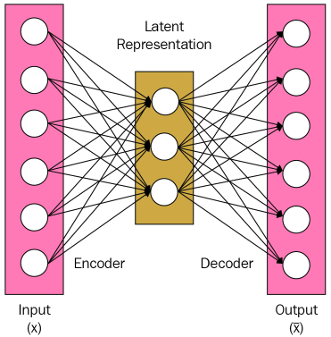

# Autoencoders

A feed forward autoencoder is a Neural Network containing two feedforward networks.
One is encoder and other is decoder.

The encoder is a feedforward network which converts the given input into a latent representation.
The decoder decodes the latent representation to reconstruct the orignal data.
Both are feed-forward networks which contain several non linear layers.
These decrease the total input representation dimension to latent representation dimensions.
## Latent Representation: -

Latent Representation is a joint representation learnt commonly by both encoder and decoder.
This is unique to encoder as well as decoder.
Learning this latent representation allows us to uniquely encrypt data.

## Training Autoencoder: -

## Latent Representation for Cryptography: -

