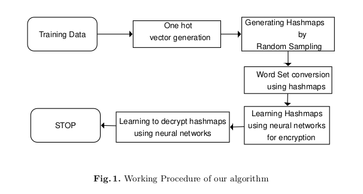

## Encrypting Data Using Auto-Encoders

The overall procedure is as below.



## Training Set And Mapping

We generate a very long string (Around 1000 - 1500 words) for training.
This is again generated by randomly shuffling characters from UTF-8 printable characters.

Code for same is below.

```
def sequence(word_length):
    # All utf-8 characters
    characters = [chr(i) for i in range(32, 123)]
    # Shuffle them
    random.shuffle(characters)
    # Add to string
    word = "".join(characters[:word_length])
    return word


def random_paragraph_generator():
    # Generate random number of words
    no_of_words = random.randint(1000, 1500)
    para = ""
    # Random Word length.
    for i in range(no_of_words):
        word_length = random.randint(1, 10)
        word = sequence(word_length)
        para += word
        para += " "
    
    # Encode in UTF-8 and return
    return para.encode("utf-8")
```

We now have a long paragraph. We simply one hot encode the paragraph.

Here our hashmap is slight hint of supervision to learn latent distribution.

To learn a latent distribution, we train encoder and decoder.

## Encoder and Decoder

The inputs of encoder are one-hot encoded data, and is hinted with labels of hashmap.
Thus we train encoder from one-hot encoded data to hashmap, learning a latent distribution (function approximation)

The outputs of encoder are passed as inputs to decoder.
The decoder learns to reconstruct back the given plain text from latent distribution.
The decoder outputs back one-hot encoded data, which is very simple to decode.

We implemented this logic in tensorflow.keras API.

## Training

We train Encoder and Decoder with `Mean Squared Error` Loss, `Adam` Optimizer.

We keep a small learning rate around `1e-3`.

Since there are not many gradients to compute, `batch size` is kept 1.

Training both Encoder and Decoder Jointly takes around 3-4 mins over CPU and 2 mins over GPU.

## Ensembling Networks

Once we have trained one set of enocder (encrypter) and decoder (decrypter).
We can use similar configuration and train another.
We trained 2 such set of encrypter and decrypters.
Both had slightly different mapping, created by mapping algorithm.
Encrypter, Decrypter small network had hashmap with encoding size 32 and a larger with encoding size 56.
This allows us to create secure networks, by ensembling them.

## Encrypting With Ensemble Networks

We have 2 sets of encrypters and decrypters this case.
Now we can use each of them to encrypt new data, we can mark each of them with IDs
We create a cryptographically secure random number which will allocate each ID to parts of long text data.
Thus networks can encrypt the data allocated to them.
The IDs allocated to them is used as a public key.

More on Keys in next page.
